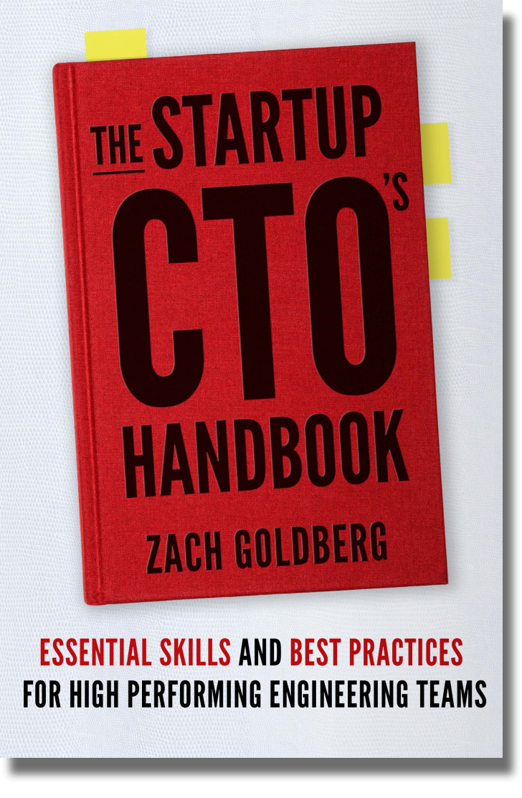

  

*NOTE:* As of October 2023 I'm still working on porting the book content into markdown. Everything is in there (via a .doc to .md auto-converter) but the formatting is all over the place and needs a lot of cleanup still, apologies for my mess in the interim!

# The Book
You can view the latest content of the book in markdown [here](StartupCTOHandbook.md)

您可以在 [amazon]（https://www.amazon.com/dp/1955811563） 上购买这本书

# The Author 作者
[Linkedin](https://www.linkedin.com/in/zachgoldberg/) / [Website](https://zachgoldberg.com) / [Email](mailto:zach@zachgoldberg.com)

# Licensing 许可
See the LICENSE file, but tl;dr - you're welcome to make copies, changes, redistribute etc. so long as you're not reselling, you keep my name/attribution attached, and you keep future versions open under a similar/the same license.

请参阅 LICENSE 文件，但 tl;DR - 欢迎您进行复制、更改、重新分发等，只要您不转售，请保留我的名字/归属，并在类似/相同的许可下保持未来版本的开放。